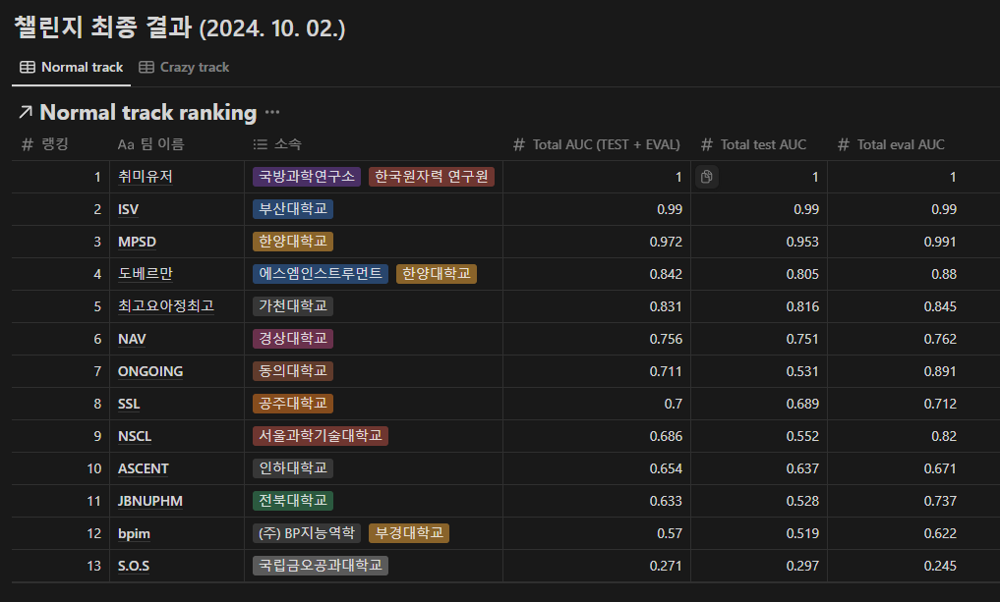
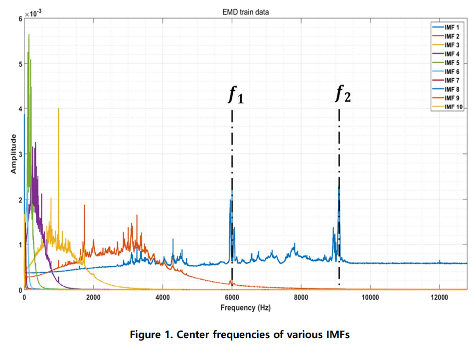
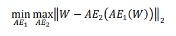
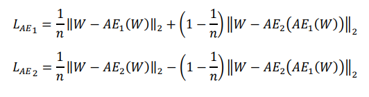
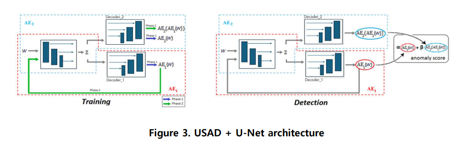
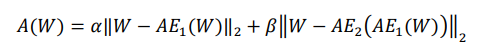
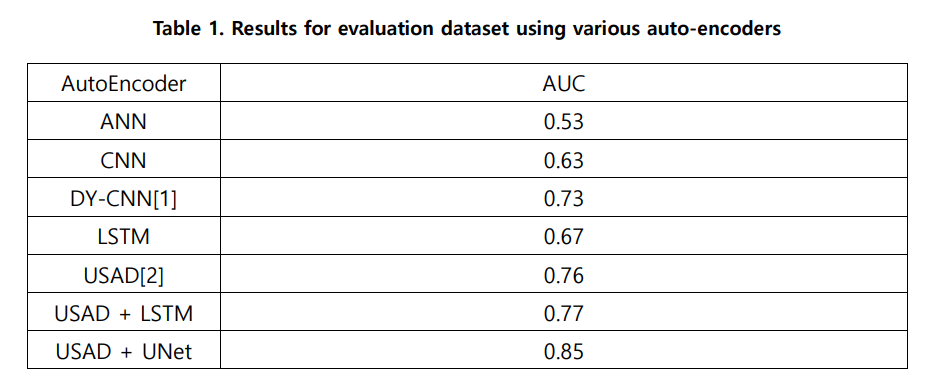

# 24_KSNVE_Data_Challenge

제 1회 한국소음진동공학회 AI 챌린지 (2024)에 참여했던 내용 
>https://ksnve.notion.site/1-AI-2024-5e0b8972e808498fb29dbb77c42ddf36

5위 달성

### 1. 데이터 분석
---

Baseline model이 제시한 신호 처리는 Mel-spectrogram을 이용하여 데이터를 전처리했다. 하지만 이는 인간의 귀에 특화된 신호 처리 기법으로 베어링의 기계 고장과는 연관이 없을 수 있다.

또한, train 데이터셋 전체를 empirical mode decomposition 후 푸리에 변환하고 모두 더해 평균적인 주파수 스펙트럼을 분석해보았다. 그 결과, 저주파 대역에서 많은 center frequency들을 확인할 수 있었고 또 넓은 대역에 거쳐 에너지가 발현되는 것을 확인했다. 하지만, 주파수 대역 f1 = 5900 ~ 6100 Hz과 f2 = 8800~9200 Hz의 경우 center frequency가 겹치지 않고 좁은 대역에 걸쳐 에너지가 발현되는 것을 확인할 수 있었다.

따라서, 데이터 전처리 과정에서 Mel-spectrogram 대신 spectrogram을 사용하고, 모든 주파수를 사용하는 것이 아니라 특정 주파수만을 사용하는 것이 타당함을 확인했다. 또한, 모델의 정확도를 높이는 미세 조정 단계에서 n_fft와 win_length을 1024에서 500으로 값을 변경했고, hop_length는 512에서 100으로 줄였다. 마지막으로, 일정한 스케일의 데이터로 모델을 학습하기 위해 최대-최소 정규화 처리된 데이터와 z-score 표준화 처리된 데이터를 모두 사용해 전처리를 마무리했다.

### 2. 모델
---
Un-Supervised Anomaly Detection (USAD) 알고리즘은 비지도학습 이상치 탐지 알고리즘에서 우수한 성적을 보여준다. Baseline의 성능이 매우 좋지 못하기 때문에 그 대신에 USAD 모델을 활용하여 성능을 증진시키고자 한다.

USAD는 한 개의 encoder와 두 개의 decoder로 구성되어 있으며, 두 개의 오토 인코더들이 정
상 인풋 데이터를 복원하며 자기 지도 학습한다. 또 이 과정에서 두 오토 인코더를 적대적으로
학습시킨다. AE1는 AE2를 속이는 방향으로 학습하고, AE2는 데이터가 실제 데이터인 W인지 아니면 AE1으로 부터 복원된 데이터인지를 구분하는 방향으로 학습한다. 따라서 학습 단계 목적함수는 아래와 같고, 

학습 단계 최종 loss 함수는 다음과 같다. 

USAD만을 사용해서 train 데이터셋을 학습했을 때, reconstruction error가 잘 개선되지 않는다는 문제점이 생겼다. 이 문제점을 개선하고자 reconstruction에 특화된 U-Net의 개념을 USAD 아키텍처에 추가로 적용하였다. 따라서 제안하는 모델 USAD + U-Net로 train 데이터셋에서 우수하게 reconstruction을 학습하고 이를 통해 강건한 anomaly score 계산을 가능하게 한다.

탐지 단계 에서 비정상 점수는 아래와 같이 정의된다.

### 3. 참고 문헌
---
[1] KIM, Seong-Hu, et al. Fault diagnosis of ball bearing using dynamic convolutional neural networks under varying speed condition. In: IECON 2022–48th Annual Conference of the IEEE Industrial Electronics Society. IEEE, 2022. p. 1-6.

[2] AUDIBERT, Julien, et al. Usad: Unsupervised anomaly detection on multivariate time series. In: Proceedings of the 26th ACM SIGKDD international conference on knowledge discovery & data mining. 2020. p. 3395-3404. 